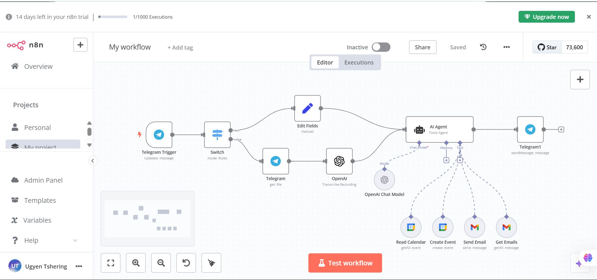
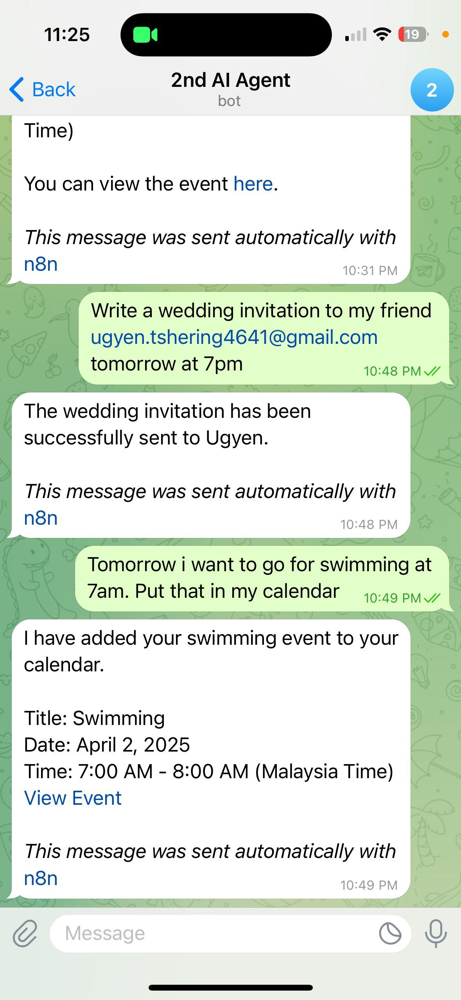
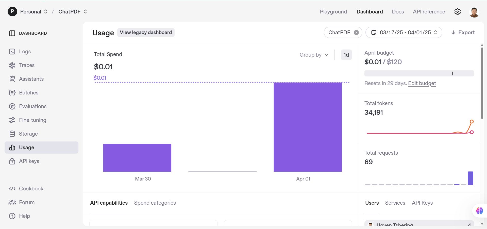

# Telegram-AI-Agent-using-n8n

I believe 2025 will be the year of AI Agents and I'm already building my second AI Agent. 

Just like chatting with ChatGPT, I can now simply type commands or send voice note in Telegram and my AI agent handles everything:
• Summarizing this week's emails
• Scheduling Google Calendar meetings
• Even sending meeting invitations
All through natural chat - no complex interfaces, just simple Telegram messages. 

  

<h4>Main Dashboard from n8n</h4>

  

    
  

  

    <h4>Demo from Telegram</h4>
    
<strong>The best part? After 2 days of using this:</strong>

    <ul>
      <li>✓ It's already saving me time daily</li>
      <li>✓ Cost me just $0.01 in OpenAI API usage for gpt4o-mini with 34k tokens (fascinating isn't it?)</li>
      <li>✓ I made this using n8n - a great tool for connecting apps without coding. If you want to build something similar, try n8n or Make.com. They make automation easy!</li>
    </ul>
  

Right now, I'm working on adding Google Docs and Google Slides and other apps support (though not all features are available yet).

AI can make our work much simpler. Have you tried building something like this?
